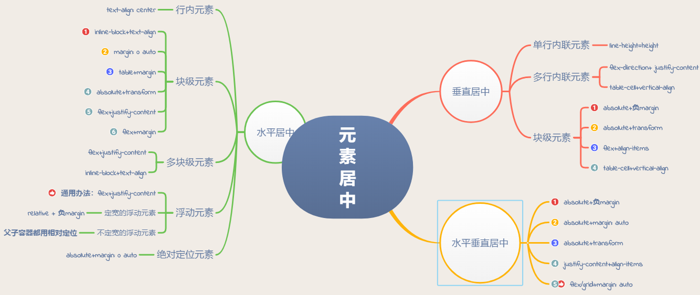

# 模拟面试题

## 七、HTML + CSS + SVG
### 说一下盒子模型
css 里的盒子，包括四个元素：
1. 实际内容 content
2. 内边距 padding
3. 边框 border
4. 外边距 margin

标准盒子模型的话，css 里的 height、width 指定是 content 的宽高
怪异盒子模型的话， css 里的 height、width 指定是 content + padding + border 的宽高

通过指定 css 属性 box-sizing 为 content-box 就可以将该盒子设为标准盒子模型
而将 box-sizing 设为 border-box 就可以将盒子设为怪异盒子模型

### 说一下文档流和文本流
文档流：元素布局的方式。具体是块级元素独占一行，行级元素从左到右排列
文本流：文本布局的方式。

绝对定位和固定定位都能让元素脱离文档流，元素文本脱离文本流；
float 浮动可以让元素脱离文档流，但不会让元素文本脱离文本流，所以适合制造文本环绕效果。

### 浮动的影响和消除浮动
浮动一般会影响它的父元素和兄弟元素：
1. 因为脱离文档流，如果父容器没有指定高度，父容器会高度坍塌。解决方案：
	1. 将父容器设为 BFC，比如将父容器 overflow 设为 hiddhien
	2. 给浮动元素后的普通文档流元素添加“clear: both”，一般是给浮动元素添加伪类来实现
2. 因为脱离文档流，后面的元素原有布局可能被打乱。解决方案
	1. 一样，给浮动元素后的普通文档流元素添加“clear: both”，一般是给浮动元素添加一个伪类

### 什么是 BFC
BFC，块级格式化上下文。具有 BFC 特性的元素可以看做一个隔离的独立容器，不论它里面的元素怎么布局，都不会影响到外部。

BFC 元素，有 5 种：
1. body 根元素，默认是 BFC
2. 浮动元素
3. 绝对对象和固定定位元素
4. display 为 inline-block、flex 等
5. overflow 是 hidden、auto、scroll（不是 visible 就行）

BFC 的特性：
1. 在同一个 BFC 里，上下两个盒子的 margin 会合并
2. 计算 BFC 高度时，把浮动的子元素也计算在内
3. BFC 内部元素布局和外部元素布局相互隔离，互不影响
4. BFC 元素不会与 float 元素重叠

### SVG 和普通的图片有什么不同

### SVG 和 canvas 有什么不同

### 说一下 SVG 的 viewBox 属性

### 水平垂直居中的实现

### document.querySelectorAll('div') 返回的是一个什么类型？怎么遍历？
返回的是一个 NodeList 类型，属于类数组对象，不过它有 forEach 方法，可以通过 forEach 方法去进行遍历，但是 some、map 这些方法是没有的。

另外，还能使用下标遍历，和迭代器遍历。

### 说一下类数组对象
类数组对象，就是说一个对象，你可以像用数组一样去使用它，比如通过下标去访问下标值，通过 length 访问长度之类的。

类数组对象，其实很多，因为类数组的这个概念，其实很模糊，你随便定义一个对象，给它加个 数值的 length 属性，然后它就可以用 Array.from 转换为一个长度为 length 的数组了。

```js
Array.from({length: 10})
```

我们真正接触比较多的原生类数组对象，一般是哪些不能调用数组原生方法（比如 forEach、some、map 等），但是有迭代器属性的原生对象，比如：
1. function 函数里的 argument 参数对象
2. NodeList 节点集合对象（这货居然是有 forEach 的）
3. HTMLCollection 元素节点集合对象
4. String 的基本包装类型（因为字符串是有迭代器的）


### NodeList 和 HTMLCollection 之间的关系/区别？
- NodeList 是节点集合，包括元素节点、文本节点等
	+ querySelectorAll → 静态集合
	+ node.childNodes → 动态集合
- HTMLCollection 是元素节点集合，都是动态集合。

要注意 querySelectorAll 返回的是 NodeList 类型，但里面全部是元素节点，并且最关键的是这个集合是静态的。

而 HTMLCollection 集合全部是动态的，比如 getElementsByTagName、getElementsByName、getElementsByClassName 返回的都是 HTMLCollection 动态集合。


### event.currentTarget 与 event.target 分别是什么？
- event.target：事件触发的元素
- event.currentTarget：绑定事件回调的元素

event.target 是事件发生事件的元素，而事件会冒泡，冒泡到我们有绑定事件回调的元素上，也就是 event.currentTarget 上，然后触发执行了事件回调。

### webpack 的 hash、contentHash 的区别
hash 值的修改，会让客户端拉取最新的资源。

如果希望一些不常修改的公共模块能够很好地利用客户端缓存的话，你可以使用 contentHash。

contentHash 的话，是只有模块有进行代码修改，它才会在构建的时候生成新的 hash。

### babel 转义原理

### 字符串的不可变性
字符串的不可变性，指的是看上去可以改变内容，但其实是地址改变了，内存中开辟了一个新的内存空间。
```js
var str = 'abc';
str = 'hello';
/* 
当给 str 赋值为新的字符串时，常量 “abc” 不会被修改，依旧留在内存上，而是开辟了一个新的内存区存放 ‘hello’， 然后让 str 去指向它。

由于字符串的不可变，在大量拼接字符串时，会有效率问题，因为需要不断开辟新的内存。
*/ 
let str = '';
for (let i = 0; i < 10000; i++) {
	str += i;
}
```

### 实现一个随输随用的搜索框，需要注意哪些点：
1. 对输入事件进行防抖，避免频繁向后端发送请求
2. 对过期响应的处理。比如我先发了 a 请求，后面又发了 b 请求，但是 b 的响应先到，而 a 的响应后到，所以 a 是一个过期的响应，我不能让它的回调把 b 的回调覆盖调，所以需要在回调这里判断一下，当前这个响应是否是过期的。判断过期的话，可以给每一个响应加一个递增 id 去判断，或者时间戳之类的
3. 用户体验方面，可以缓存用户之前的搜索记录

### 前端大文件上传怎么实现
1. 用 FileReader api 读取大文件，再用 File.prototype.slice 对文件进行切片，然后逐片发送到后台。
2. 全部分片发送完毕之后，再发送一个请求，通知后台去将这些文件分片进行合并

### 给你一个数据怎么判断它的类型
1. 对于基本类型，typeof 就行了
2. 对于引用类型，typeof 全部返回  ‘object’，所以需要其他方法：
	+ instanceof 操作符，判断一个对象是否是某个构造函数的实例
	+ 访问原型上的 constructor 指针，可以拿到实例的构造函数 
	+ Object.prototype.toString.call( 实例 )，缺点是不能判断自定义类型

### 如果要 Object.prototype.toString.call 判断自定义类型呢？
这个只能去修改 Object.prototype 上的 toString 方法了：
```js
class test {}

let toString = Object.prototype.toString;

Object.prototype.toString = function() {
	if (this instanceof test) {
		return '[Ojetct test]'
	} else {
		return toString.call(this, ...arguments);
	}
}
```

### promise 实例对象
1. state 属性 → 0 是 pending，1 是 fulfilled，2 是 rejected，3 的话是这个 pormise 已经被 resolve，但 resolve 的参数是另一个 promise
2. value 属性 → promise 的值
3. 回调数组 → 里面存着用 then 指定的回调的封装类


### promise 异步控制原理
1. promise 通过 then 指定的回调，会封装一个回调类，然后放到一个数组里存放起来。
2. 异步回调执行到 resolve / reject 的时候，就会去把回调数组里的对应的回调拿出来执行

### promise 链式调用原理
我们指定，then 可以指定 promise 的回调，这个回调的参数来自于 promise 的 value 值（resolve/reject 的值）。

而 then 本身会生成一个 promise 对象，这个 promise 的 value 则是来自 then 回调的 return 值，所以它可以指定下一个 then 回调并把这个 return 值作为参数传递下去。

### promise 的状态传递 / promise catch 统一处理错误原理
> catch 本身是 then 的语法糖，catch(fn) == then(null, fn)

如果一个 promise 已经完成了，then 也执行了，但是没有指定到合适的回调，那么 promise 的值会传递给 then 产生的 promise 作为它的值。
```js
new Promise(resolve=>resolve('1'))
.then()
.then()
.then(res=>console.log(res)) // 1
```
catch 的原理，本质就是前面的 then 没有指定 reject 回调，所以全部传递到 catch 这里来了。所以 catch 一般放到末尾来统一处理链式 promise 的错误，并且前面的 then 一般只会指定 fulfilled 回调。


### promise.all 原理
promise.all 会遍历全部的 promise，给它们指定 then 回调，这个 then 回调会做两件事：
1. 拿到 promise 的 value 值后，根据 promise 所在下标，插入到返回值数组对应的位置
2. 有一个变量是维护当前还在 pending 的 promise 数量，then 回调会把它减一 

当这个数量减少到 0 时，就说明全部的 promise 都已经完成了，并且 promise 的值也按照顺序插入到了一个数组里面去。

最后，这个数组作为 promise.all  产生的 promise 的返回 value 值。

### async/await 原理
async 函数本身是一个 generator 函数，不过它内部做了封装，有一个自动执行的机制，这个机制是给 await 后的 promise 指定回调为 generator 函数的迭代器的 next 方法。

### async 触发错误回调
```js
(async ()=> {
	Promise.reject(22);
})()
.then(null, err=>console.log(err));
```
在上例中，是不会触发错误回调的。

为什么，因为 async 函数内部的每一步都是 try catch 执行的，只有 try catch 能捕捉到的错误，才能被 reject 传递出来，进而触发错误回调。
```js
try {
	Promise.reject(22);
} catch(err) {
	console.log(err)
}
// 这样是捕获不到错误的，因为 Promise.reject(22) 本身没错
```

### 用 es5 去实现一个 generator 函数的话要怎么实现

### 原生 ajax
```js
// 1. 创建 xmlhttprequest 对象
let req = new XMLHttpRequest;
// 2. 调用 open api，去指定请求地址
req.open('GET', 'http://taobaoer.com/todos/1');
// 3. 监听 readystate 修改触发的回调，来写入请求成功的逻辑
req.onreadystatechange = ()=>{
	if (req.readState == 4 && req.status == 200) {
		// 成功逻辑
	}
}
// 4. 调用 send api 正式发起请求
req.send();
```

### 元素居中



### 响应式布局


### 清除浮动

浮动会导致元素脱离文档流，但是元素文本不会脱离文本流，所以浮动一般是用来实现文本环绕的这么一个功能。但是，过度使用浮动也会带来一些影响：
1. 父容器高度坍塌：
	+ 把父容器设成 BFC，比如给父容器加个 overflow：hidden
	+ 给浮动元素后的普通文档流元素加个 ‘clear：bothj'’，一般是给浮动元素的 after 伪类添加
2. 因为浮动元素脱离文档流，导致其后面的布局被打乱
	+ clear both

### 说一下 BFC
BFC，块级格式化上下文。它有一个特性，就是可以看作一共独立的容器，内部元素的布局不会影响到外部的元素，比如：
1. BFC 内部元素不会和 BFC 外部的元素进行 margin 合并
2. BFC 在计算高度时，会把浮动子元素也算进去
3. 脱离文档流的浮动元素，是无法覆盖普通文档流 BFC 元素的

怎么开启 BFC：
1. overflow 的值不是 visible，是 hidden、auto、scroll
2. display 是 inline-block、flex、table-cells
3. float 元素也是一个 BFC
4. 绝对定位/固定定位元素，也是一个 BFC
5. body 根元素也是一个 BFC

### 盒子模型

盒子模型分两种：标准盒子模型和怪异盒子模型

先说说盒子吧，一个元素由内到外是：
1. content 内容
2. padding 内边距
3. border 边框
4. margin 外边距

标准盒子模型的话，我们通过 css 设定的宽高就是 content 的宽高；
而怪异盒子模型的话，我们通过 css 设定的框是 content + padding + border 的宽高


### 块级元素和行级元素的区别
1. 块级元素会独占一行；行级元素是从一行从左到右排列
2. 块级元素可是设定宽高、margin、padding；行级元素的宽高由文本绝对，margin 和 padding 只能设定左右的而不能设定上下的
3. 块级元素内部可以包含其他块级元素、行级元素、文本；行级元素内部只能包含其他行级元素和文本

### 说一下事件流，和事件委托 
为什么要提出事件流这个东西，因为假如你在页面点击了一个元素，其实等同于点击了元素的父容器，也等同于点击了整个 html。将事件以事件流的形式去来回传播，可以定位到事件真正触发的目标元素。

事件流，分三阶段：
1. 捕获
2. 处于目标对象
3. 冒泡

事件委托，其实就是利用了事件冒泡。因为对于一个容器元素来说，它里面的子孙元素如果触发了事件，最终肯定要冒泡到容器元素本身的，所以可以在容器元素这里，对子孙元素的事件做个统一处理，具体一点就是通过 event.target 来判断具体触发事件的是哪个子孙元素，来执行对应的逻辑。

事件委托的好处就是，减少了 DOM 元素的事件绑定，进而提升页面性能。

### mouseenter 和  mouseover 有什么区别：
- **mouseenter**：鼠标进入目标元素触发，**不能冒泡**，所以鼠标进入子元素时**不会触发**目标元素的该事件
- **mouseleave**：鼠标离开目标元素触发，**不能冒泡**，所以鼠标离开子元素时**不会触发**目标元素的该事件
- **mouseover**：鼠标进入目标元素触发，**可以冒泡**，所以鼠标进入子元素**会触发**目标元素的该事件
- **mouseout**：鼠标离开目标元素触发，**可以冒泡**，所以鼠标离开子元素**会触发**目标元素的该事件

### 函数柯里化


### 数组扁平化

递归

### 数组去重

1. 双重循环
2. 用 indexOf 替代双重循环的内循环
3. 先排序，再去重
4. set 结构去重，不过要注意的是，对于 set 的去重判断，NaN 是等于另一个 NaN 的

### 对象浅复制和深复制

递归

### npm 模块安装机制，为什么输入 npm install 就可以自动安装对应的模块

1. 执行 preinstall 钩子
2. 确认首层依赖，就是 dependencies 和 devDependencies 中直接指定依赖的模块
3. 通过递归去构建模块依赖树，最后对模块进行扁平化，就去除重复的依赖模块
4. 安装模块到项目的 node_modules 里
5. 执行 install、postinstall、prepublish、prepare 生命周期钩子


### 说一下重绘和回流
当我们下载一个 html 资源时，会解析 html 生成 DOM 树，解析 css 生成 css 树，然后把二者结合成 render 树，最后用 render 树去计算布局，绘制页面。

重绘是什么呢？就是重新绘制页面，比如你修改了元素上一些非几何属性的样式，比如颜色、透明度这些，就会引发页面的重绘。

回流是什么呢？就是对页面重新布局，比如你修改了元素的一些几何属性，比如宽高、位置等，就会引发页面的回流。回流一定引发重绘，重绘不一定引发回流。

### 观察者模式和订阅-发布模式的区别？
> ps：我在阅读《JavaScript 设计模式于开发实际》一书中，两种是混为一谈的。

GitHub 上有一种说法是，观察者模式是没有中间商赚差价，而订阅-发布模式是有中间商赚差价的。

观察者模式下，有两个角色，主体和观察者，主体一旦改变，就通知全部观察者的。

而订阅发布模式，其实有三个角色，除了发布者和订阅者，还有一个信息中介，就是说订阅者和发布者是不知道对方的存在的，他们通过信息中介进行通信。

### 说一下浏览器和 node 的事件循环的区别

浏览器事件循环：
1. 执行一个宏任务
2. 执行全部微任务
3. 判断是否需要重新渲染

node 事件循环
1. timer 阶段，定时器宏任务
2. poll 阶段，异步 I/O 回调
3. check 阶段，setImmediate 回调

另外，微任务：
- 浏览器是执行一个宏任务后，清空全部微任务
- node 10 以前是执行一个宏任务阶段的宏任务，再去清空微任务，node 11 以后就和浏览器统一了，执行一个宏任务就清空全部微任务

### const 和 let 生命的变量不在 window，那到底在哪里？
通过断点调试，可以发现 const 和 let 是定义在一个 scirpt 块级作用域里的。

> 所以，可以理解为，js 脚本外部其实套了一个块级作用域，也就是 {} 吗？


### cookie 和 token 的区别：
- 从服务端的角度看：cookie 一般配合 session 使用，session 是保留到服务端的，会使用服务端的空间。而 token 不会保留到服务端，但服务端收到 token 后需要对 token 进行解析。所以从服务端的角度看，cookie 消耗的是空间，而 token  消耗的是时间。
- 从安全性角度看：cookie 是保留到浏览器的，浏览器会给相同域名的请求携带相同域名的 cookie，所以可以被 csrf 攻击利用到。而 token 是前端 js 自己去保存的，也是前端 js 自己在请求头部上放上 token 的，所以可以避免 csrf 攻击。

### 代码阅读题
```js
var b = 10;
(function b() {
  b = 20;
  console.log(b) // function b
})()
console.log(b) // 10
```

- 全局 b：函数、变量声明提前，然后执行变量赋值，所以 b 最后被赋值为 10。
- 局部 b：因为立即执行函数比较特殊，b 可以立即为用 const 声明的常量，常量无法修改，所以 b=20 无效。

> 我其实有个问题，既然在 GO 上读取 b 是 10，那么在函数 b 内部用作用域链去访问 GO 上的 b 不应该还是 10 吗？还是说，返回 b 的时候，读的是自己 AO 上的 b？但自己的 AO 上有 b 吗，这个函数不是声明在全局的 GO 上的吗？

### 拓展，简单改造上面的代码，让他可以输出 10、20
```js
var b = 10;
(function b() {
  b = 20;
  console.log(window.b) // 10
})()

var b = 10;
(function b() {
  var b = 20;
  console.log(b) // 20
})()
```

### 说一下浏览器缓存


