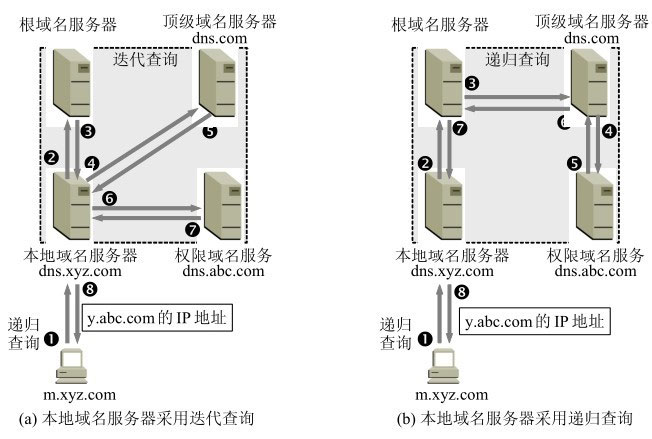

# 计算机网络
## 一、概述
- ISP：互联网供应商，它可以从互联网管理机构获得许多 ip 地址，同时拥有通信线路以及路由器等联网设备。
- 主机之间的通信方式
	+ C/S：客户-服务器
	+ P2P：对等，不区分客户端和服务端
- 计算机网络体系：
	+ 应用层：为特定的应用程序提供通信服务，比如 HTTP、DNS 等
	+ 表示层：负责数据压缩、加密、描述等。比如 IBM 主机使用 EBCDIC 编码，而大部分 PC 机使用的是 ASCII 码，为了二者上的应用层的通信，就需要表示层进行数据的编码转义。
	+ 会话层：建立和管理会话
	+ 传输层：负责主机上进程之间的通信，主要使用 TCP 和 UDP 协议
	+ 网络层：为主机与主机之间提供数据传输服务，比如 IP 协议
	+ 数据链路层：主机之间通过链路连接起来，链路层协议是用来给同一链路上的主机提供通信服务端的
	+ 物理层：控制比特流的传输，对上屏蔽传输媒体和传输手段的不同，让数据链路层感受不到

## 二、物理层
### 2.1 通信方式
- 单工信道：数据只能单向传输
- 半双工信道：数据双向只能**交替**传输
- 全双工信道：数据双向可以同时蹿升
### 2.2 数据通信模型

- 源点：源点设备产生要传输的数据，传递给发送器。
- 发送器：对源点产生的数据进行编码。典型的发送器是调制器，将离散信号编码成模拟信号。
- 接收器：对接收到的数据进行解吗。典型的接收器是调解器，将模拟信号调解成离散信号。
- 终点：接收接收器传递来的数据比特流，然后处理数据。

## 三、数据链路层
### 3.1 数据链路
所谓链路，是一个结点到相邻节点的一段物理线路，所以也可以叫物理链路。

而数据链路，是在物理链路丧加上必要的通信协议，控制数据的传输，抽象而成的一个**逻辑链路**。

### 3.2 三个基本问题
数据链路层的三个基本问题就是：**封装成帧、透明传输、差错检测。**
#### 3.2.1 封装成帧
把网络层传下来的分组作为帧的数据部分，然后添加上帧头和帧尾，这就产生了一个帧：
- 帧头
- 帧的数据部分 → ip 数据报
- 帧尾

帧头和帧尾主要用于标记帧的开始和结束，这样，接收端在数据链路层接受到物理层上交的比特流时，就能够用帧头和帧尾来识别帧的开始和结束。

#### 3.2.2 透明传输
帧使用首部和尾部进行定界，如果帧的数据部分含有**开始 / 结束控制符**时，帧的开始 / 结束位置就会被错误地判定。

这个时候，需要对数据部分中的开始 / 结束控制符进行转义。

转义的过程，对于用户来说是看不到的，所以叫透明传输？

#### 3.2.3 差错检测
比特在传输的工程中可能会产生差错，比如某一个位会从 1 变为 0，这种叫**比特差错**。

数据链路层为了保证数据传输的可靠性，在数据链路层广泛使用了**循环冗余检验（CRC）**来检查比特差错。

### 3.3 信道分类
数据链路的信道主要有两类：
- 点对点信道 → 一对一
- 广播信道 → 一对多，一个节点发送的数据能被广播信道上所有节点接收到

#### 3.3.1 点对点信道
一对一通信，一般不会发送碰撞，因此比较简单，使用 PPP 协议进行控制。

PPP 协议是干嘛的呢，简单说就是：接受方每收到一个帧，就进行 CRC 检验。如果检验通过，就收下这个帧，反之，丢弃这个帧，其他什么也不做。

#### 3.3.2 广播信道
所有的节点都在同一个广播信道上发送数据，因此需要专门的控制方法进行协调，避免发生冲突，主要有两种控制方法进行协调：
- 信道复用技术
- CSMA/CD 协议

### 3.4 MAC 地址

MAC 地址是链路层地址，长度为 **6 个字节（48位）**，用于唯一标识网络适配器（网卡）。

一台主机拥有多少网络适配器就有多少个 MAC 地址。例如笔记本电脑普遍存在无线网络适配器和有线网络适配器，因此就有两个 MAC 地址。

**只要不更改自己的MAC地址，MAC地址在世界是唯一的**。形象地说，MAC地址就如同身份证上的身份证号码，具有唯一性 。

### 3.5 局域网

局域网是一种典型的广播信道，可以按照网络拓扑结构进行分类：

- 星型
- 环形
- 直线型

以太网是一种星型拓扑结构的局域网，以交换机进行连接。

### 3.6 交换机

交换机是一种链路层设备，能够根据 MAC 地址进行存储和转发帧。

交换机具有自学习的能力，学习的是交换表的内容，交换表里存储着 MAC 地址到接口的映射。

下图中，交换机有 4 个接口，主机 A 向主机 B 发送数据帧时，交换机把主机 A 到接口 1 的映射写入交换表中。为了发送数据帧到 B，先查交换表，此时没有主机 B 的表项，那么主机 A 就发送广播帧，主机 C 和主机 D 会丢弃该帧，主机 B 回应该帧向主机 A 发送数据包时，交换机查找交换表得到主机 A 映射的接口为 1，就发送数据帧到接口 1，同时交换机添加主机 B 到接口 2 的映射。

## 四、网络层

网络层是整个互联网的核心，因此应该让网络层尽可能简单。网络层向上只提供简单灵活的、无连接的、尽最大努力交付的数据报服务。

使用 IP 协议，可以把异构的物理网络连接起来，使得在网络层看起来好像是一个统一的网络。

与 IP 协议配套使用的还有三个协议：
- 地址解析协议 ARP
- 网际控制报文协议 ICMP
- 网际组管理协议 IGMP

### 4.1 IP 地址和编址方式
ip 地址就是给因特网上每一个主机（或路由器）的每一个接口分配一个在全世界范围内是唯一标识符。ipv4 的 ip 地址是 32 位，ipv6 的 ip 地址是 128 位。

ip 地址的编址方法经过了三个历史阶段：
- 对 ip 地址进行分类
- 子网的划分
- 构成超网

#### 4.1.1 分类的 ip 地址
> **ip 地址 ::={\<网络号\>, \<主机号\>}**

分类如下：

其中，A、B、C 类 ip 地址都是单播地址（一对一通信），比较常用
而 D 类地址是多播地址（一对多通信）

#### 4.1.2 划分子网

二级 ip 地址有缺陷：
1. **ip 地址空间利用率有时候不高**。比如 B 类地址的网络号，主机号最多可以分配给 6 万多个主机，但实际上一个网络上所能连接的计算机数量有限，根本达不到 6 万个，这就造成了 ip 地址的浪费。
2. **每一个物理网络都分配一个网络号，会导致路由表变得过大，降低查找速率，使网络性能变坏。**
3. **二级 ip 地址不够灵活。**每次想使用一个新的网络号，都需要新申请一个。

所以，提出了子网划分。就是**从两级 ip 地址的主机号里，划出几个位来作为子网号**，也就得到了三级 ip 地址：
> **ip 地址 ::={\<网络号\>, \<子网号\>, \<主机号\>}**

因为子网位数的不确定性，所以需要有一个机制来判断一个 ip 地址究竟属于一个网络的哪一个子网，所以，有了子网掩码的出现。

子网掩码的时候很简单。每一个子网都有自己的子网掩码，当我们拿到一个 ip 地址的时候，将这个 ip 地址和子网掩码进行想与运算，如果最后的运算结果和子网一样，那么这个 ip 地址就是该子网的 ip 地址。

> 【例子】已知IP地址是141.14.72.24，子网掩码是255.255.192.0。试求网络地址。

如果一个网络没有划分子网，那么它会有一个默认的子网掩码，也就是该类网络的子网掩码。

另外，划分子网虽然增加了灵活性，但是却减少了能够连接到网络上的主机总数，原因如下：
- 子网的位数里，没有 0，1，15 和 16，因为没有意义
- RFC 950文档，子网号 /  主机号不能为全 1 或全 0（现在其实全 1 和全 0 的子网号也可以使用了）

#### 4.1.3 构造超网

子网划分在一定程度上解决了二级 ip 地址的困境，但很快它也迎来了新的问题：**IPv4 的地址在 2011 年的时候，被耗尽了。**

为了解决这个问题，一方面提出无分类编址方法，另一方面成立 IPv6 工作组对 ip 协议进行升级。

构造超网，属于前者，也就是无分类编址，正式名字叫做无分类域间路由选择，简称 CIDR。

> **ip 地址 ::={\<网络前缀\>, \<主机号\>}**

CIDR 特点如下：

1. 取消 A 类、B 类、C 类和子网划分的概念。把 32 位 ip 地址分为两个部分：网络前缀 + 主机号。然后采用“斜线记法”，在 ip 地址后面加上斜线 ‘/’ 和网络前缀所占位数。如：`128.14.35.7/20`

2. CIDR 的 ip 地址，拥有一个 32 位地址掩码，该地址掩码的前缀 1 个数为斜线记法中斜线后面的数字

3. 网络前缀相同的连续 ip 地址，组成一个 “CIDR 地址块”，在路由表中理用 CIDR 地址块进行目的网络的查找。这种地址聚合称为路由聚合。

**在路由表中的项目由 “网络前缀” 和 “下一跳地址” 组成，在查找时可能会得到不止一个匹配结果，应当采用最长前缀匹配来确定应该匹配哪一个。**

### 4.2 IP 数据报

- **目标地址：接受方的 ip 地址，32 位**
- **源地址：发生方的 ip 地址，32 位**
- **版本：4 或 6，对应 IPv4 和 IPv6 两个值**
- **首部长度**：占 4 位，所以表示范围为 0 → 15。数值 1 代表 4 个字节。首部固定 20 个字节，所以该值最小为 5，也就是 5 → 15
- **总长度**：包括首部长度和数据部分长度
- **协议**：该 IP 数据报向上传递给传输层时，传输层使用什么协议进行处理
- **生存时间**：TTL，以路由器跳数为单位，当 TTL 为 0 时丢弃数据报，防止无法交付的数据报在互联网不断兜圈子。
- **标识+位偏移**：处理数据报过长的情况，对数据报进行分片。

### 4.3 地址解析协议 ARP

ARP 协议的作用，就是已知目标主机的 ip 地址，然后用 ip 地址去解析出对应的硬件地址（MAC 地址）。

具体的话，就是每一个主机会有一个 **ARP 高速缓存**，里面存放了一下 ip 地址到硬件地址的映射关系。当你要给一个某个主机 B 发送一个 ip 报时，会先去字节的 ARP 高速缓存里查看有没有主机 B 的硬件地址，有的话就可以用这个硬件地址来写入 MAC 帧，给数据链路层使用。

那么如果自己 ARP 高速缓存里面没有主机 B 的硬件地址映射呢？

那么它就会向本地局域网**广播一个 ARP 请求分组**，表示它想查找某个 ip 地址的硬件地址。本地局域网上所以主机都会收到这个 ARP 请求，包括主机 B。主机 B 收到这个 ARP 请求后，就返回一个 **ARP 响应**，这个响应包含自己的硬件地址。而其他收到 ARP 请求的主机，则会忽视这个请求。

**ARP 请求是广播的，但 ARP 响应是单播的**，因为 ARP 请求里包含了请求方的硬件地址。

### 4.4 IP 层分组转发（以子网划分为标准）

主机与主机之间往往不是直接通信，而是需要经过路由器作为中转，进行分组的转发，来实现不同 ip 直接的数据传输。

路由器，用以分组转发，它内部维护一个路由表，这个路由表的每一项包含三项内容：

- **目的网络地址**
- **子网掩码**
- **下一跳地址**

另外，还存在特定主机路由，用以给特定的 ip 地址指明下一跳路由。

所以，当一个主机发送了一个 ip 报文，这个 ip 报文会通过路由器去不断进行分组转发，直到转发到目的 ip 所在网络地址上的路由器。

**当一个路由器，收到一个 ip 数据报分组时，它的分组转发算法具体如下：**

1. **从收到的 ip 数据报里提取目标 ip 地址 D；**
2. **判断是否可以直接交付 → 对与该路由直接相连的网络进行子网掩码的想与运算，如果运算结果与该网络一致，则可以直接交付。否则，执行 3；**
3. **如果路由表里有目标地址为 D 的特定主机路由，则将 ip 数据报文交付到指定的下一跳路由。否则，执行 4；**
4. **对路由表里每一项路由记录进行匹配，就是用子网掩码进行进行运算后判断运算结果是否与目标网络地址一致，一致的话就将 ip 数据报文交付到指定的下一跳路由。若全部匹配失败，则执行 5；**
5. **如果路由表有默认路由，则将 ip 数据报交付到默认路由指定的下一跳路由。否则，执行 6；**
6. **报告分组转发出错。**

> 【例子】已知图4-24所示的互联网，以及路由器R1中的部分路由表。现在源主机H1向目的主机H2发送分组。试讨论R1收到H1向H2发送的分组后查找路由表的过程。
> 
> 1. 用本子网的子网掩码 255.255.255.128 与目的主机的 ip 地址 128.30.33.138 逐位想与，得到 128.30.33.128，和本子网 128.30.33.0 不一致，说明二者不在一个子网下。所以，把 ip 数据报发给子网的默认路由 R1，由 R1 进行转发。
> 2. R1 收到分组后，在路由表中逐行寻找有无匹配的网络地址。最后用第二行的子网掩码 255.255.255.128 和目的主机 ip 地址进行逐位想与，得到 128.30.33.128，符合该路由记录上的目标网络地址。子网查找成功。
> 3. 因为主机 H2 是直接连接在该子网上的，所以路由器可以直接把 ip 数据报交付给主机 H2。

另外，每一次的分组转发，不是用路由的 ip 地址直接转发，而是用 ARP 协议解析路由的 MAC 地址，封装到 MAC 帧的首部，交付给数据链路层进行数据传输。

所以，在一次 ip 通信里，如果从物理链路层去看，会发现 MAC 帧里的 MAC 地址是不断修改的，但 MAC 帧数据部分里，ip 数据报的 ip 地址（源地址、目标地址）是一直不变的。

### 4.5 网际控制报文协议 ICMP

**ICMP 是为了更有效地转发 IP 数据报和提高交付成功的机会**。它封装在 IP 数据报中，但是不属于高层协议。

ICMP 属于 ip 数据报里的数据部分，被发送出去。

ICMP 报文分两类：
- ICMP 差错报告报文
- ICMP 询问报文

ICMP 报文组成：
- 前 4 个字节：三个字段，表示类型、代码、校验和
- 紧接着 4 个字节：内容与 ICPM 类型有关
- 数据字段：长度取决于 ICMP 类型

#### 4.5.1 ICMP 差错报告报文
ICMP差错报告报文共有五种，即：
- 终点不可达：当路由器或主机不能交付数据报时就向源点发送终点不可达报文。
- 源点抑制：当路由器或主机由于拥塞而丢弃数据报时，就向源点发送源点抑制报文，使源点知道应当把数据报的发送速率放慢。
- 时间超过：当路由器收到生存时间为零的数据报时，除丢弃该数据报外，还要向源点发送时间超过报文。当终点在预先规定的时间内不能收到一个数据报的全部数据报片时，就把已收到的数据报片都丢弃，并向源点发送时间超过报文。
- 参数问题：当路由器或目的主机收到的数据报的首部中有的字段的值不正确时，就丢弃该数据报，并向源点发送参数问题报文。
- 改变路由（重定向）：路由器把改变路由报文发送给主机，让主机知道下次应将数据报发送给另外的路由器（可通过更好的路由）。

ICMP 差错请求报文的格式是一样的：
1. 首先，有一个 ip 数据报出现了上述错误，需要进行差错报告。
2. 然后，把这个 ip 数据报的首部和数据部分的前 8  个字节提取出来，作为 ICMP 报文的数据部分。
3. 再然后，加上 ICMP 报文的前 8 个字节，就构成了 ICMP 差错报告报文。
4. 最后，加上首部，把  ICMP 报文封装成一份 ip 数据报进行发送。

#### 4.5.2 ICMP 询问报文
ICMP 询问报文分两类：
1. Echo 请求和回答报文：主机或路由器，给一个特定的目的主机发送一个 Echo 请求报文，收到此报文的主机必须给源主机或路由器发送一个 Echo 回答报文。这种询问报文用来测试目的站是否可达以及了解其相关状态，比如 ping。
2. 时间戳请求和回答报文：给某个主机或路由器发送一个 ICMP 时间戳请求报文，要求其回答当前的日期和时间。回答报文种有一个 32 位的字段，其中写入的整书表示从 1900.1.1 到现在一共有多少秒。

> Ping 的原理是通过向目的主机发送 ICMP Echo 请求报文，目的主机收到之后会发送 ICMP Echo 回答报文。Ping 会根据时间和成功响应的次数估算出数据包往返时间以及丢包率。

### 4.6 路由器

#### 4.6.1 路由器结构

路由器可以分为两部分：
1. 路由选择部分。根据路由选择协议构造出路由表，同时不断更新和维护路由表。
2. 分组转发部分。根据路由表对分组进行转发。

路由选择部分是路由器的核心，主要是通过一些路由选择协议，来维护更新路由表。路由选择协议可以分位两大类：
1. 内部网关协议：在一个自治系统内部使用的路由选择协议，比如 RIP 和 OSPF；
2. 外部网关协议：处于不同自治系统的主机通信时的路由选择协议，比如 BGP；

## 五、传输层
网络为主机直接通过逻辑通信，而传输层为应用进程之间提供端对端的逻辑通信。

但是每一个主机上的进程创建和撤销都是动态的，而且不同主机的进程标识符也不一致。所以很难T通过 TCP / UDP 报文来直接指定主机上某一个进程来进行通信。

所以，我们在运输层使用协议端口号，传输层协议只需要负责把数据发送到目的主机上指定的一个端口，剩下的对应用进程交付的工作则由 TCP 完成。

端口号范围是 0 → 65535，即 2 的 16 次方，需要 16 位来存储。

### 5.1 UDP 和 TCP
UDP 是无连接，面向报文，没有拥塞控制，尽最大努力交付的协议。

UDP 面向报文的意思是，对于应用层交下来的报文，即不合并，也不拆分，而是保留这些报文的边界。（你传给我的是多大，我就发多大）

TCP 是面向连接，提供可靠交付，有流量控制、拥塞控制，建立全双工通信的协议。

TCP 的两个端点，不是主机，不是应用进程，也不是传输层的协议端口，而是 socket 套接字。
> socket 套接字 = （IP 地址：端口号）

### 5.2 TCP 首部

- 源端口和目的端口：端口号占 16 位。
- 序号：本报文里，第一个数据字节的序号。
- 确认号：期待对方下一个报文里，第一个数据字节的序号。
- 数据偏移：TCP 报文里，数据部分距离报文起始处有多远。其实就是首部长度。
- 6 个控制位：说明本报文段的性质。
- 窗口：该报文发送方的接收窗口大小，用来控制接受方的发送窗口大小，进行流量控制。

### 5.3 TCP 三次握手和四次挥手

三次握手：

四次挥手：

### 5.4 可靠传输 → 超时重传

略

### 5.5 流量控制 → 滑动窗口

所谓流量控制，就是让发送方的发送速率不要太快，要让接受方来得及接收。报文首部里有一个窗口字段，表示发送方的接收窗口大小，接受方会用这个接收窗口大小来调节自己下一次发送报文时的发送窗口大小，以实现浏览器控制。

滑动窗口，就是在发送方和接收方各自维护一个窗口：
1. 发送方发送报文时，将发送窗口里的分组全部发送出去；
2. 接受方收到分组后，对按序到达的最后一个分组进行确认，然后调整自己接收窗口的位置和大小，把确认和接收窗口大小返回给发送方；
3. 发送方用分组确认来移动窗口位置，用接收窗口大小来调节发送窗口大小；

因为发送方和接受方身份可以互换，所以一共有 4 个窗口。每一方都有一个发送窗口和接收窗口，对应发送方和接收方身份。

### 5.6 拥塞控制 → 拥塞控制算法

拥塞控制和流量控制关注点不一样：

- 流量控制，关注的是接受方来不来得及处理发送方发送的数据
- 拥塞控制，关注的是整个网络的拥塞情况

拥塞控制有 4 种算法：慢开始、拥塞避免、快重传、快恢复。

#### 5.6.1 慢开始和拥塞避免
发送方会维护一个拥塞窗口 cwnd，这个拥塞窗口会随着网络拥塞的情况而动态变化。
> 所以，实际发送分组数量 = min ( 拥塞窗口大小，发送窗口大小 )

慢开始，就是先把 cwnd = 1 去发送分组，收到分组的确认后，把 cwnd 加倍。

拥塞避免，就是给慢开始设定一个上限，当 cwnd 到达这个上限后，就进入拥塞避免阶段，cwnd 不再加倍递增，而是 +1 递增。

当发送超时重传时，把慢开始上限减半，然后重新开始执行慢开始。

#### 5.6.2 快重传和快恢复
发送方如果收到了三次对同一个分组的确认，那么就判断为下一个分组丢失，执行快重传，重传下一个报文段。

因为这种情况，一般属于部分报文段的缺失，而不属于网络拥塞，所以需要快恢复。快恢复就是跳过慢开始阶段，重新进入拥塞避免阶段。

## 六、应用层

### 6.1 DNS
DNS 协议是用来解析域名得到 ip 地址的。

DNS 解析过程如下：
1. 先在浏览器缓存上找 DNS 记录
2. 浏览器缓存找不到，去操作系统缓存找 DNS 记录
3. 操作系统缓存找不到，请求本地 DNS 服务器
4. 如果本地 DNS 服务器上也没有，则由本地域名服务器向根域名服务器发起 迭代/递归 查询，最后把查询结果返回给浏览器

迭代查询和递归查询的区别：

### 6.2 HTTP
略
### 6.3 HTTPS
略

## 七、网络攻击
### 7.1 xss 攻击

### 7.2 CSRF 攻击

