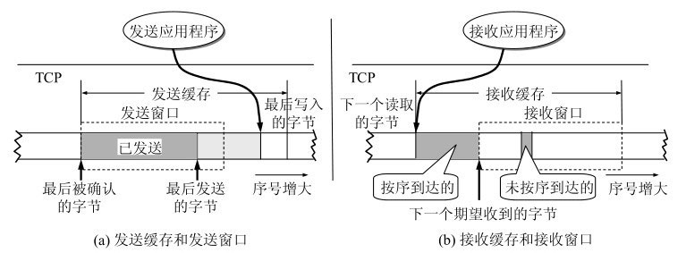
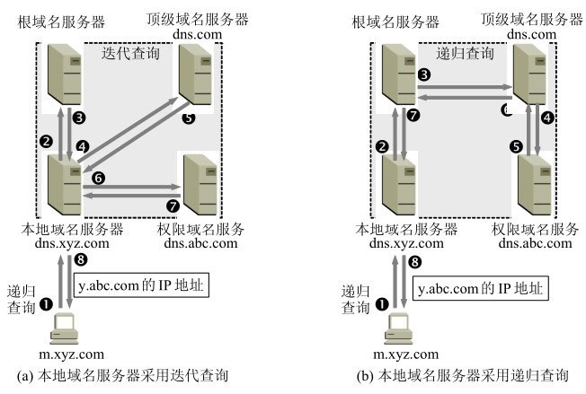

# 模拟面试题

## 四、 计网

### 说一下 OSI 模型

从上到下是：
1. 应用层：为特定**应用程序**提供数据传输服务，比如 HTTP、DNS 等协议。
2. 表示层：**数据压缩、加密以及数据描述**，使得应用程序不必关心在各台主机中数据内部格式不同的问题
3. 会话层：**建立、管理、终止会话**
4. 传输层：为不同主机的**进程**提供数据传输服务，比如 TCP、UDP 协议
5. 网络层：为**主机**提供数据传输服务，比如 IP 协议
6. 数据链路层：主机之间可以有很多链路，链路层协议就是为了**在同一链路下的主机**提供数据传输服务
7. 物理层：在连接各种计算机的传输媒体上传输数据**比特流，**屏蔽不同传输媒体和通信手段的差异，让数据链路层感受不到这些差异。

传统的五层协议的话，是将表示层、会话层都归属到了应用层。

TCP/IP 四层模型是：
1. 应用层
2. 传输层
3. 网络层
4. 网络接口层

**数据在各层之间的传递过程：**
+ 向上：需要不断添加下层协议需要的首部或尾部
+ 向上：需要不断拆开首部或尾部

### 说一下 TCP 和 UDP 的区别
UDP 特点:
1. 无连接
2. 尽最大努力交付
3. 没有拥塞控制
4. 面向报文
5. 支持一对一、一对多、多对一和多对多

TCP 特点：
1. 面向连接
2. 提供可靠交付
3. 有流量控制、拥塞控制、提供全双工通信
4. 面向字节流
5. 每一条 TCP 连接都是点对点（一对一）

所以说白了，它们最大的区别就是， UDP 把报文发出去就不管了，但 TCP 的话会连接一条通道，通过超时重传机制来保证这份报文一定要发送到对方那里，也因此 TCP 要维护滑动窗口、计时器、缓存……，对于资源的消耗会比 UDP 大。

### 说一下运输层的复用和分用
复用：多个应用层的进程，使用同一个运输层的服务
分用：运输层从网络层收到报文，会分发到对应的应用层进程

### 说一下 TCP 可靠传输
可靠传输，说白了就是我要保证发送方的每一份报文都能到达接收方。具体一点就是，**超时重传**，我发送了一份报文过去，等过一段时间没有收到对应对这份报文的确认，那么我就认为这份报文是没有抵达接收方的。

可靠传输有那么几个协议：
1. 停止等待协议。发送一个报文后，要等收到这份报文的确认之后，我再发送下一份报文，如果等待超时了就重发。这种协议最大的缺点是，信道利用率低。
2. ARQ 协议。发送方维护一个发送窗口，在发送窗口里的分组都可以连续发送出去，而不需要等待确认。接收方呢，只需要对按序抵达的最后一个分组发送确认，不过这样有一个缺点，就是比如我发 5 个分组，只有第 2 个没到，但接收方之后返回第一个分组的确认，所以发送方要重发后面 4 个分组，其中有 3 个分组是没必要在发送的。
3. 滑动窗口协议。在发送方维护一个发送窗口，接收方维护一个接收窗口，发送窗口的大小由接收方指定并以此来进行流量控制。另外，可以通过选择确认 SACK 来避免 ARQ 协议的缺点，简单点说就是用多个位来表示不连续缺少的分组。

### 说一下 TCP 流量控制
所谓流量控制，就是让发送方的发送速率不要太快，要让接收方来得及接收。
TCP 通过滑动窗口协议的来实现流量控制。

滑动窗口：
1. 在发送方和接收方都维护一个窗口，窗口的单位是字节。
2. 发送报文的时候，就把发送窗口里的分组连续发送出去。接收窗口收到分组后，拿到最后一位有序的分组，并向前移动接受窗口，最后给有序到达分组的最后一位返回确认，附带表示接收窗口 rwnd 大小的值：
	1. 分组确认是用来让发送窗口向前移动的，以便发送新的分组
	2. 接收窗口 rwnd 是用来控制发送窗口大小的，以便进行流量控制

### 说一下 TCP 的发送缓存和接受缓存
发送缓存组成（左到右）：
1. 已发起且收到确认的分组
2. 已发送但未收到确认的分组（发送窗口左端）
3. 待发送分组（发送窗口右端）
4. 未发送分组

接收缓存组成（左到右）：
1. 已到达但未分发的分组
2. 未到达的分组（接收窗口左端）
3. 未按序到达的分组（接收窗口内部）

### 说一下 TCP 拥塞控制
如果网络出现拥塞，分组将会丢失，此时发送方如果继续重传，会让网络更加拥塞。所以需要一个拥塞控制的机制，去降低整个网络的拥塞程度。

发送方需要维护一个叫拥塞窗口（cwnd）的状态变量，以此去影响发送窗口的大小。
> 实际发送窗口 = min ( 拥塞窗口 cwnd，接收窗口 rwnd )

### 说一下 TCP 拥塞控制使用到的算法
TCP 的拥塞控制主要通过四个算法：慢开始、拥塞避免、快重传、快恢复。

慢开始和拥塞避免：
> 慢开始，就是让拥塞窗口从 1 开始，所以只发生一个分组，当收到分组确认，再把拥塞窗口加倍以发送更多分组。
>
> 拥塞避免呢，就是给慢开始设定一个门槛 ssthresh ，当拥塞窗口到达某个限制后，就不是加倍递增，而是加一递增。
> 
> 如果出现超时，则把拥塞避免的限制 ssthresh 减半，重新执行慢开始

快重传和快恢复：
> 快重传，就是发送方如果收到三个对相同分组的确认，那么立即对收到重复确认分组的下一段分组进行重传。
> 
> 快恢复，就是对于快重传这种情况，只是丢失部分报文段，而不属于网络拥塞。因为进行快恢复，令 令 ssthresh = cwnd / 2 ，cwnd = ssthresh，即直接进入到拥塞避免阶段。

### 说一下 TCP 拥塞控制和流量控制的不同
出发点不同：
1. 流量控制是控制发送方发送分组的速率，以便接收方能来得及接收。
2. 拥塞控制关注点是整个网络，是为了降低整个网络的拥塞程度

### 说一下 TCP 三次握手
1. 第一次握手：客户端发送一个 SYN=1，ACK = 0 的报文给服务端，表示请求建立连接
2. 第二次握手：如果服务端收到第一次握手的请求报文后，如果同意建立连接，返回一个 SYN=1，ACK=1 的响应报文
3. 第三次握手：客户端收到服务端的响应报文，还需要再给服务端发送一个 ACK=1 的确认报文。

第三次握手的目的，是为了防止已经失效的请求再次抵达服务端而产生错误。一个失效的连接请求发送到服务端，服务端依旧会返回一个确认给客户端。但因为这是一个失效请求的确认，所以客户端会无视它，不会发起第三次握手。服务端没有收到第三次握手，就明白刚刚的请求是失效的，不会建立连接。
### 说一下 TCP 四次挥手
1. 第一次挥手：客户端发送一个 FIN=1 的报文，表示断开连接
2. 第二次挥手：服务端收到客户端第一次挥手报文后，返回客户端一个确认，表示自己已经收到了请求，但是它还没准备好，可能还有一些其他的请求没处理完毕。
3. 第三次挥手：服务端准备好断开连接了，就给客户端发送一个 FIN=1 的报文，表示断开连接
4. 第四次挥手：客户端收到第三次握手的报文后，给服务端发送一个确认报文。服务端收到确认报文后，就可以释放连接了，但是客户端还需要等待 2MSL 的时间才断开连接。等待 2MSL 的目的是，确保第四次握手成功发送到服务端，以及处理服务端可能的对“已失效连接请求”的确认返回。

### 说一下 HTTP/1.1 和 HTTP/2.0 的区别
1. HTTP/2.0 的多路复用：
	- HTTP/1.1是串行共享一个 TCP 连接，上一个请求结束了，下一个的请求才会发起
	- HTTP/2.0 实行并行策略，多个请求可同时在一个 TCP 连接上并行执行，也叫多路复用
2. 数据流格式不一样：
	- HTTP/1.1 使用的是文本流
	- HTTP/2.0 使用的是二进制分帧，服务器解析起来会更快
3. 首部压缩
	- HTTP/1.1 首部不会压缩，每一次请求都需要发送一个新的首部
	- HTTP/2.0 在客户端和服务端之间维护一个首部字段表，这个首部字段表会包含之前出现过的首部字段，每次发起请求只会发送要更新的首部字段。另外，还使用了编码算法对首部进行压缩
4. 服务端推送
	- HTTP/1.1 不支持服务端推送
	- HTTP/2.0 支持服务端推送

### 说一下 HTTPS
HTTP 有三个缺点：
1. 明文传输 → 内容可能被窃听
2. 不验证通信双方 → 通信方可以伪造
3. 不验证报文完整性 → 报文可能被篡改

所以，提出了 HTTPS。

1. 加密：加密方式有两种，共享密钥加密和公开密钥加密。HTTPS 采取两者混合方式进行通信内容的加密。首先，通信双方先通过公钥加密传递一把共享密钥，然后后续的通信用这边共享密钥进行通信。
2. 验证通信双方：服务端的公钥需要提交给第三方权威机构进行认证，第三方机构会给公钥颁发证书，证书上有一个数字签名，这个签名用第三方机构私钥加密。服务端在给客户端发送公钥的时候把证书也发过去，客户端本地拥有第三方机构的公钥，可以认证证书上的数字签名的真实性，进而认同证书的权威性，也就相信了发送公钥的服务端。这个是客户端认证服务端。也存在客户端证书让服务端认证客户端，但是比较少，加格也昂贵。
3. 验证报文完整性：通过报文摘要来验证报文完整性。HTTP 也报文摘要，但因为它是明文传输，所以报文摘要也很容易进行篡改。HTTPS 因为加密导致报文摘要的成功篡改比较困难，进而可以保证报文完整性。

优点：能解决 HTTP 的三大缺点
缺点：因为需要对通信内容进行加密和解密，传输速度比 HTTP 慢；需要购买证书，需要一定成本。
		

### 说一下跨域
首先，跨域是什么？
跨域是因为浏览器的同源策略，导致 AJax 无法对非同源的资源进行请求。
同源的意思是：相同协议+相同域名+相同端口

然后，怎么解决？
第一，JSONP。
创建一个 script 标签插入文档，script 不受同源策略限制，会对它的 src 发起 get 请求，然后将响应数据传入指定的回调函数，我们从那个回调函数里获取 JSONP 跨域请求的响应。
优点是简单，而且不需要服务端做出修改。
缺点是只能发起 get 的跨域请求。

第二，CORS。
CORS 也叫跨域资源共享。一般是客户端发起请求的时候，在首部 Origin 字段告诉服务器自己的源，服务器判断该请求源是否在自己的允许跨域白名单里，如果在的话就同意跨域返回响应。另外对于一些特殊请求，比如发送 json 数据的 post 请求，浏览器会先发送一个 option 预检请求。

优点是：能够解决全部请求类型的跨域问题。
缺点是：不兼容一些较老的浏览器，而且需要服务端配置

第三，代理服务器
在本地搭建一个与页面同源的代理服务器，页面向代理服务器发送请求，代理服务器向真实服务器转发请求。常见的有 nodejs 代理服务器和 nginx 反向代理。

优点是：不需要服务端修改
缺点是：代理服务器搭建麻烦，不过可以结合一下脚手架工具来简化搭建工作

### ARP 解析 MAC 地址

### 浏览器 DNS 解析域名过程
1. 先在浏览器缓存找 DNS 记录
2. 如果浏览器没有，向操作系统缓存找 DNS 记录
3. 如果操作系统没有，则向本地域名服务器发起 DNS 记录查询请求（这应该属于递归查询）
4. 如果本地域名服务器上也没有，则本地域名服务器向根域名服务器发起迭代查询/递归查询
5. 查询过程一般是：
	+ 请求根域名服务器 → 得到顶级域名服务器地址
	+ 请求顶级域名服务器 → 得到二级域名服务器
	+ 请求二级域名服务器 → 得到主机名服务器
	+ 请求主机名服务器 → 得到四级域名服务器
	+ ……

### DNS 的迭代查询和递归查询有什么区别

用本地服务器发起域名查询为例：
1. 递归查询：
	+ 本地服务器 request 根域名服务器 → 查询顶级域名
    + 根域名服务器 request 顶级域名服务器 → 查询二级域名
    + 顶级域名服务器 request 二级域名服务器 → 查询主机域名
    + 二级域名服务器 response 顶级域名服务器 → 返回主机域名
    + 顶级域名服务器 response 根域名服务器 → 返回主机域名
    + 根域名服务器 response 本地服务器 → 返回主机域名
2. 迭代查询
	+ 本地服务器 request 根域名服务器 → 查询顶级域名
	+ 根域名服务器 response 本地服务器 → 返回顶级域名
	+ 本地服务器 request 顶级域名服务器 → 查询二级域名
	+ 顶级域名服务器 response 本地服务器 → 返回二级域名
	+ 本地服务器 request 二级域名服务器 → 查询主机域名
	+ 二级域名服务器 response 本地服务器 → 返回主机域名

总结：递归查询，就是不断把查询任务交给下一级域名服务器；而迭代查询，则是让请求域名服务器返回的下一级的域名服务器地址，然后自己再去请求下一级域名服务器。

### CND + OSS 加速原理
1. CDN 内容分发网络，就是把源站资源缓存到多个边缘节点，然后当客户端对源站发起请求时，会把请求引导到距离客户端最近的边缘节点上，一方面距离更短资源访问速度肯定更快，另一方面可以分摊源站的访问请求压力。
2. OSS 阿里云对象存储，使用它作为 CDN 的源站的话，可以利用其更大的带宽和更大的存储，用来实现对客户端对大文件资源的快速访问。

### 说一下常见的网络攻击

#### 1. xss 攻击
xss 攻击，通过给网页注入 js 代码，代码执行后会对网页进行攻击，比如盗取 cookie、sessionStorage 等。

常见的 xss 攻击分三类：

1. 反射型 xss 攻击，一般是诱导用户点击某个链接，而攻击脚本会直接放在请求 url 上，最后又返回给页面，这个过程类似反射，所以叫反射型 XSS，也叫非持久型 XSS。

2. 存储型 xss 攻击，存储型 XSS，一般是通过页面的输入框去注入 js 脚本代码到后端的数据库，然后页面下次再拉取数据时，会直接拉取到 \<script\> 脚本，然后直接解析执行。它比反射型 xss 危害更大，因为它是将攻击代码存储到数据库，而数据库里的数据可能是全部用户都能请求的，也就是说可能对全部用户产生危害。

3. DOM 型 xss 攻击，前端页面使用了 innerHTML、outerHTML 进行 DOM 插入时，不会对 script 标签进行转义，所以一旦通过这些 api 插入的模板字符被注入 script 脚本，就会产生攻击。 

xss 攻击的攻击目的很多，我们可以对不同目的的攻击进行预防。比如，xss 攻击可能会通过 js 盗取你的 cookie，那么提前把保留登录态的 cookie 设为 http-only，避免可以通过 js 通过 document.cookie 进行访问。

另外，还有一种常见的预防操作就是，对 scrpit 标签进行转义。无论是前端还是后台，对于一些可能要插入到页面的字符串都进行转义，避免被插入 scrpit 脚本而去执行。

#### 1. CSRF 攻击
CSRF 攻击，是欺骗用户浏览器，让其以用户的名义运行操作。

用户登录一个网站 A，然后退出，但是没有关闭浏览器，这时，登录态 cookie 还保留在浏览器里。
然后，用户去浏览第三方网站，第三方网站可以利用网站 A 的 cookie 来伪造用户身份，向网站 A 的服务器发送恶意请求。

预防 CSRF 攻击，有很多方法，下面列举两个：

1. 请求源检测：http 的请求头有一个请求源字段，服务端通过判断请求源来拦截请求。但，如果第三方网站和原网站是同源的，或者伪造头部字段，就没办法了。
2. 添加校验 token：token 是前端网页所持有的，而不是浏览器所持有的，所以 CSRF 是无法利用token ，也就是无法伪造身份。

### HTTP 常见状态码
- **2xx 成功**
	+ 200 请求被正常处理
	+ 204 请求成功，但没有资源可以返回
- **3xx 重定向**
	+ 301 永久性重定向
	+ 302 临时性重定向
	+ **304 和重定向没有关系，表示资源已经找到，但客户端不符合请求条件**
- **4xx 客户端错误**
	+ 400 请求报文语法错误
	+ 401 请求需要认证 / 认证失败
	+ 403 资源不允许被访问
	+ **404 服务器上没有该请求的资源**
- **5xx 服务端错误**
	+ 500 服务端内部资源故障
	+ 503 服务端超载/停机维护

### 说一下 HTTP 2.0 的多路复用
简单点说，就是在同一个 TCP 连接里，同一时刻可以发起多个 http 请求。

- http1.0，是一个 http 请求就建立一次 tcp 连接。
- http1.1，可以开启 keep-alive，允许多个 http 请求共用一个 tcp 连接，但是是串行共享，就是下一个请求必须等待上一个请求响应了才能发送。
- http 2.0，实现了多路复用，让多个 http 在同一个 tcp 连接里可以并行请求。

### 说一下  cookie、token 的区别
- cookie 的话，一般是前端发送登录请求，服务端会在本地生成一个 session 记录登录态，然后把 sessionID 包在 cookie 里返回给前端，这个 cookie 会保留在浏览器，并记录下该 cookie 的域名。**在下次发送的请求时，浏览器就会自动把同域名的 cookie 带上**。因为 cookie 代表的其实浏览器，所以可以被第三方网站利用 CSRF 攻击来发送恶意请求。
- token 的话，是发送登录请求，服务端会用算法加密生成一个 token，作为登录的令牌，返回给前端。这个 token 需要前端用 js 去 http 头部里读出来的然后存起来的，发送的时候也是需要前端用 js 去放到 http 首部上的。因为 token 不是经过浏览器发送，而是 js 去操作的，所以 CSRF 无法利用 token 去伪造用户发送恶意请求。

