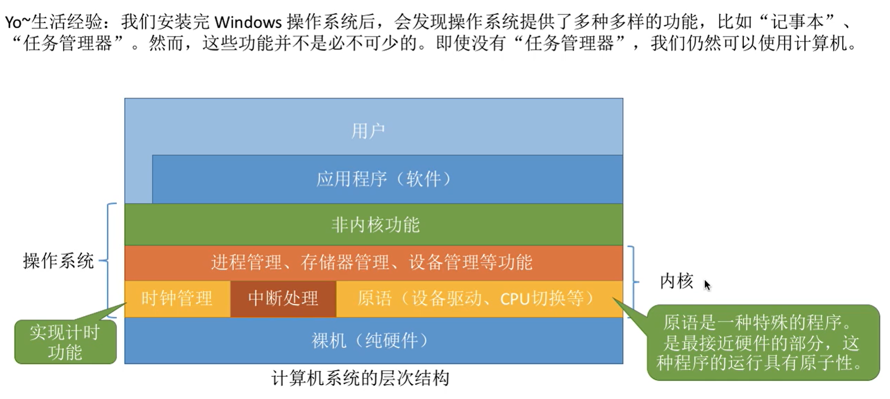
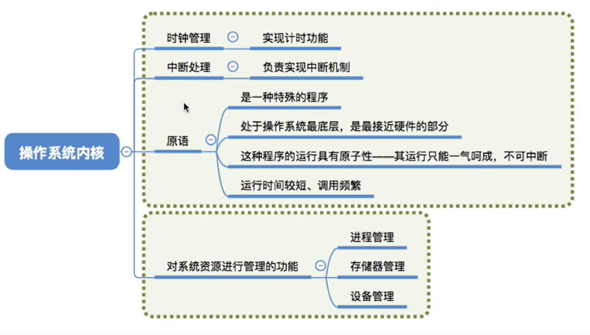

# 再来一轮复习

## 一、基础概念

### 1.1 操作系统四大特性
+ **并发**：并行是指程序微观上的同时执行，而并发是指程序宏观上的同时执行，并发在微观上可能还是交替执行。
+ **共享**：
    + 互斥共享：一个时间段里只允许一个进程访问的资源，比如QQ和微信不能同时使用摄像头。
    + 同时共享：一个时间段里可以由多个进程 ”同时“ 访问的资源，比如QQ和微信可以同时读取磁盘来传输文件。不过，这个 “同时” 指的是宏观上的同时，也就是并发。
+ **虚拟**：
	+ 时分复用：比如时间片轮转，在微观上 CPU 交替执行各个进程
	+ 空分复用：比如虚拟存储技术
+ **异步**：一个进程的执行往往不是一次性完成的，而是走走停停，以不可预知的速度向前推进。（比如，进程 A 想执行时，必须获得资源 a，但此时资源 a 被进程 B 所占用，所以进程 A 陷入等待，必须等到进程 B 用完资源 a 后，进程 A 才能够继续执行）

### 1.2 操作系统的分类
> 前景知识：一个程序的执行分两步：1. 将程序读入内存；2. CPU 运行程序。

1. 手工操作阶段：用户独占全机、人机速度矛盾（人工输入慢、计算机处理快），导致资源利用率极低。
2. 单道批处理系统：引入脱机输入/输出技术，缓解了一定程度的人机速度矛盾，资源利用率有所提升。但**内存中只存放一道程序**，上一道在内存的程序被 CPU 运行完毕后，下一道程序才开始被读入内存。**CPU 有大量的时间在等待程序的 I/O 完成，资源利用率依旧很低**。
3. 多道批处理系统：和单道批处理系统相比，它会**一次性往内存输入多道程序**，并引入**中断**技术，由操作系统负责管理这些程序的运行。各个程序**并发**执行，共享计算机资源，资源利用率大幅提升。缺点是，用户响应时间长，没有人机交互功能（用户提交作业后只能等待计算机处理完成，中间不能控制自己的作业执行）。
4. 分时操作系统：以时间片为单位，轮流为各个用户/作业服务，各个用户可以通过终端与计算机进行交互。缺点是，操作系统对于每一个用户/作业都是完全公平的，不能优先处理一些紧急任务。
5. 实时操作系统：计算机系统接收到一个作业后，要在严格的时限内处理完作业，主要特点是及时性和可靠性。
6. 网络操作系统
7. 分布式操作系统
8. 个人计算机操作系统：比如 window、MacOS

### 1.3 OS 的运行机制和体系结构

#### 1.3.1 运行机制
指令：CPU 能识别、执行的最基本命令。高级编程语言最终都会被编译为机器语言指令来执行。指令分为两类：
+ **特权指令**：不允许用户程序使用，如内存清零指令
+ **非特权指令**：用户程序可以使用，如普通的运算指令

那么，CPU 是如何判断当前是否可以执行特权指令的呢？CPU 的执行状态可以分为两类：

+ **用户态**（目态）：此时 CPU 只能执行非特权指令
+ **核心态**（管态）：特权指令、非特权执行都能执行

> CPU 有一个程序状态寄存器（PSW），里面某一标记位可以用来标识当前 CPU 处于什么状态，比如 0 为用户态，1 为核心态。

对应的，CPU 执行的程序也分成了两类：

+ **内核程序**：操作系统的内核程序是系统的管理者，**既可以执行特权指令，也可以执行非特权指令**，运行在核心态。

+ **应用程序**：为了保证系统能够安全运行，普通应用程序只能执行非特权指令，运行在用户态。

#### 1.3.2 操作系统内核

内核，是计算机上配置的底层软件，是操作系统最基本、最核心的部分。实现操作系统内核功能的那些程序，就是内核程序。

#### 1.3.4 操作系统的体系结构
对于不同的操作系统，它的内核划分可能不太一致。内核划分主要有两种划分：
+ 大内核：将操作系统的主要功能模块都作为系统内核，运行在 CPU 核心态
	+ 优点：高性能
	+ 缺点：内核代码庞大，结构混乱，难以维护
+ 微内核：只把最基本的功能保留在内核
	+ 优点：内核功能少，结构清晰，方便维护
	+ 缺点：需要频繁地在核心态和用户态之间切换，性能低

### 1.4 中断和异常

#### 1.4.1 中断机制的诞生

对于单道批处理系统，程序与程序直接的执行是串行的，也就是：
程序 A 被读入内存 → CPU 运行程序 A → 输出程序 A 结果 → 程序 B 被读入内存 → CPU 执行程序 B → 输出程序 B 结果。

因为 GPU 需要等待程序的 I/O 操作，导致资源利用率较低。

为了解决上诉问题，人们发明了操作系统，**引入了中断机制，实现了多道程序并发执行**。

#### 1.4.2 中断的概念和作用
1. 当中断发生时，CPU 立即进入核心态
2. 当中断发生后，当前运行的进程暂停运行，并由操作系统内核对中断进行处理
3. 对于不同的中断信号，会进行不同的处理

**发生了中断，就意味着需要操作系统介入，开展管理工作**。由于操作系统的管理工作（比如进程切换、分配 I/O 设备等）需要使用特权指令，因此 CPU 用从用户态转为核心态。中断可以使 CPU 从用户态切换为核心态，使操作系统获得计算机的控制权。有了中断，才能实现多道程序并发执行。

用户态、核心态之前的切换是怎么实现的？
- **用户态 → 核心态：通过中断实现的，并且中断是唯一途径。**
- 核心态 → 用户态：通过执行一个特权指令，将 psw 的标记位置为“用户态”。

#### 1.4.3 中断的分类

1. **内中断**（异常、陷入）：**中断信号来自于 CPU 内部，与当前执行的指令有关**
   + 指令中断：系统调用时，使用的陷入指令
   + 强迫中断：比如缺页中断、整数除 0 导致异常中断
2. **外中断**（狭义上的中断）：**中断信号来自于 CPU 外部，与当前执行的指令无关**
   + 外设请求：I/O 操作完成后发出的中断信号
   + 人工干预：用户强行终止一个进程

#### 1.4.4 外中断的处理过程

1. 每条指令执行结束后，CPU 检查是否有外部中断信号
2. 若有外部中断信号，则需要保护被中断进程的 CPU 环境
3. 根据中断信号类型，转入相应的中断处理程序（CPU 进入核心态）
4. 恢复原进程的 CPU 环境并退出中断，返回原进程继续往下执行

### 1.5 系统调用

应用程序通过系统调用请求操作系统的服务。从 CPU 的角度看，系统调用会触发中断信号，让 CPU 由用户态切换到核心态。

## 二、进程

### 2.1 进程的定义、组成、组织方式、特征

进程，是进程实体的运行过程，是系统进行资源分配和调度的一个独立单位。

进程实体的组成：

- **程序段**：存放程序的代码
- **数据段**：存放程序运行时使用、产生的运算数据。
- **进程控制块(PCB)**：操作系统管理进程所需要的数据，比如程序段指针、数据段指针等。
  + 进程标识符：唯一标识该进程
  + 处理机状态信息：处理机中断该程序时，处理机的各种寄存器信息会被存到这里，等处理机重新执行该程序时能从断点复原程序执行。
  + 进度调度信息：
    + 进程状态，指明当前进程状态
    + 进程优先级，优先级高的进程优先获得处理机
    + 进程调度所需的其他信息，比如进程已等 cpu 时间、进程已执行时间
    + 事件，比如阻塞原因等。
  + 进程控制信息
    + 程序和数据的地址
    + 进程同步和通信机制
    + 资源清单
    + 链接指针，本进程所在队列的下一个进程 pcb 首地址

### 2.2 进程的状态与转换

### 2.3 进程控制

### 2.4 进程通信

进程通信，就是进程之间的数据交换。每一个进程拥有自己的内存地址空间，为了保证安全，其他进程是无法访问本进程的内存地址空间的。所以，需要一些特殊的进程通信方式，让进程之间的可以进行数据交换。

进程通信方式：共享存储、管道通信、消息传递。

#### 2.4.1 共享存储
通过在内存开辟一块共享空间，让其他进程可以对共享空间进行数据的读写，进而实现进程的通信。另外，还需要结合进程的同步机制来实现进程对共享空间的互斥访问，比如 p、v 操作。

共享存储分两种：
1. **基于共享数据结构的通信**：共享空间里只能存放固定的数据结构进程通信，比如只能放一个长度为 10 的数组。这种共享方式速度慢、限制多，是一种**低级通信**方式。
2. **基于共享存储区的通信**：在内存划出一块共享存储区，存储的数据格式、位置都**由进程来控制，而不是由操作系统决定**。这种共享存储方式速度更快，是一个**高级通信**方式。

#### 2.4.2 管道通信

管道通信，采用**半双工通信**，实现**单向数据流**的传递。本质是在内存中开辟一个大小固定的缓冲区，作为两个进程的共享文件，一个进程去写文件，另一个进程去读文件。

数据以**字符流**的形式写入管道。当管道写满时，写进程的 write() 系统调用将被阻塞，等待读进程将数据取走。当读进程将数据全部取走后，管道为空，此时读进程的 read() 系统调用将被阻塞。

**如果没有写满，不允许读；如果没读空，就不允许写。**

#### 2.4.3 消息传递

一个消息实体的组成：

1. 消息头：包括**发送进程 id、接受进程 id**、消息类型、消息长度等格式化的信息
2. 消息体：消息的具体内容

进程通过操作系统提供的 **“发送消息/接受消息” 两个原语**进行数据交换。

消息传递由两种方式：
1. 直接通信方式
2. 间接通信方式

**直接通信方式**
发送进程创建了一个信息，然后通过发送原语直接将消息发送到接受进程的消息缓冲队列上，接受进程再通过接受原语从自己的**消息缓冲队列**里读取消息。

**间接通信方式**
和直接通信方式类似，不同的是消息传递过程多了一个**中间实体“信箱”**，发送进程先将消息发送到“信箱”，接受进程在从“信箱”里读取消息。

### 2.5 线程的概念和多线程模型

#### 2.5.1 进程与线程

1. 进程是资源分配的基本单位，而线程是调度的基本单位。
2. 一个进程可以拥有多个线程，线程可以访问隶属进程的资源。
3. 进程的切换需要切换进程环境，系统开销大；线程的切换是在同一个进程内的切换，系统开销小。

#### 2.5.2 线程的分类

1. 用户级线程：线程管理工作由应用程序负责，线程的切换也是在 CPU 用户态下即可完成
2. 内核级线程：线程管理工作由操作系统内核完成，线程调度、切换都由内核负责，所以内核级线程的切换必然需要在核心态下才能完成

> 复习：进程的切换需要中断，CPU 会切换到核心态

在只支持用户级线程的系统里，CPU 调度的基本单位还是进程。而在支持内核级线程的系统里，操作系统只 ”看得见“ 内核级线程，因此 CPU 调度的基本单位是线程。

#### 2.5.3 多线程模型

在同时支持用户级线程和内核级线程的系统中，由几个用户级线程映射到几个内核级线程的问题引出了 ”多线程模型“ 问题。多线程模型主要分为：

1. 多对一模型：多个用户级线程映射到一个内核级线程。
   + 优点：用户级线程切换在 CPU 用户态下即可完成，不需要切换到核心态。
   + 缺点：一个用户级线程被阻塞，整个进程都被阻塞。
2. 一对一模型：一个用户级线程映射到一个内核级线程。
   + 优点：一个线程被阻塞，别的线程还可以执行。
   + 缺点：用户级线程的切换会导致核心级线程的切换，CPU 需要切换到核心态。
3. 多对多模型：n 用户级线程映射到 m 个内核级线程（n >= m），每个用户进程对应 m 个内核级线程。
   + 特点：上述二者的集成，结合了两者的优点，又克服了两种的缺点

### 2.6 处理机调度的概念、层次

调度，按照某种算法选择一个进程将处理机分配给它。

调度分三个层次：

1. 高级调度 → 作业调度 → 选择一个作业，将其调入内存，并为其创建进程
2. 中级调度 → 内存调度 → 从挂起队列里，选择合适的进程将其数据从外存调回内存
3. 低级调度 → 进程调度 → 从就绪队列里，选择一个进程为其分配处理机

### 2.7 调度算法

#### 2.7.1 作业调度算法
> 作业调度算法，既适用于作业的调度，也适用于进程的调度
1. 先来先去服务 → 按照作业/进程到达的时间先后来进行调度 → 排在长作业后的短作业会 “饥饿”
2. 短作业优先 → 执行时间最短的作业/进程优先被调度 → 长作业会“饥饿”

#### 2.7.2 进程调度算法
> 进程调度算法，用于进程的调度
1. 时间片轮转 → 从就绪队列里取队头进程，让其执行一个时间片，若进程没执行完则放入队尾 → 进程切换频繁，有一定开销；不区分任务紧急度

2. 优先级调度 → 给每一个进程分配一个优先级，按照优先级大小进行调度 → 导致低优先级进程“饥饿”

3. 多级反馈队列：
	+ 设计多级反馈队列，各级反馈队列优先级从高到低，时间片从小到大
	+ 新进程到达时先进入1级队列，按照 FCFS 原则分配时间片去执行，用完时间片后进程未执行完毕则被推入下一级队列队尾
	+ 只有上一级就绪队列为空了，才会取调度下一级就绪队列的进程

## 三、内存管理

## 四、文件管理

## 五、I/O 设备管理